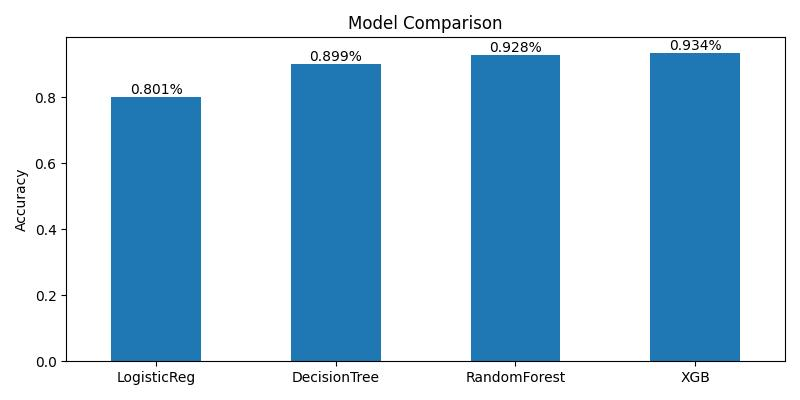

# CreditAnalysis


<div style="text-align: center;">
  
  
  
  
  
  
  
  
  
</div>

A machine learning-based system for predicting loan approval likelihood by analyzing applicant data to determine creditworthiness.

## 🔍 Overview

CreditAnalysis is a sophisticated loan approval prediction system that leverages machine learning algorithms to assess loan applications. By analyzing various applicant attributes, the system provides reliable predictions on loan approval probability, helping financial institutions make data-driven decisions and streamline their loan approval process.

The project implements multiple classification algorithms to ensure high accuracy and reliability in credit risk assessment.


## ✨ Features

- **Multiple ML Models**: Implements various algorithms for comparison and optimal performance:
  - Random Forest Classifier
  - Decision Tree Classifier
  - XGBoost
- **Data Preprocessing**: Comprehensive data cleaning and preparation pipeline
- **Feature Engineering**: Extracts and transforms relevant features for improved model performance
- **Model Evaluation**: Detailed performance metrics and comparison between different models
- **Prediction Interface**: Easy-to-use interface for making predictions on new loan applications

## 🚀 Installation

### Prerequisites
- Python 3.7+
- pip (Python package manager)

### Setup Instructions

1. Clone the repository:
   ```bash
   git clone https://github.com/Lucky-Langa/CreditAnalysis.git
   ```

2. Navigate to the project directory:
   ```bash
   cd CreditAnalysis
   ```

3. Create and activate a virtual environment (recommended):
   ```bash
   python -m venv venv
   
   # On Windows
   venv\Scripts\activate
   
   # On macOS/Linux
   source venv/bin/activate
   ```

4. Install required dependencies:
   ```bash
   pip install -r requirements.txt
   ```

## 💻 Usage

### Training Models

```python
# Example code to train the models

models = {
    'LogisticReg': LogisticRegression(solver='saga', max_iter=1000),
    'DecisionTree': DecisionTreeClassifier(),
    'RandomForest': RandomForestClassifier(),
    'XGB': XGBClassifier()
}

X = loan_data.drop('loan_status', axis=1)
y = loan_data['loan_status']

X_train, X_test, y_train, y_test = train_test_split(X, y, test_size=0.2, random_state=42)
imputer = SimpleImputer(strategy='median')
X_train = imputer.fit_transform(X_train)
X_test = imputer.transform(X_test)

scaler = StandardScaler()
X_train_scaled = scaler.fit_transform(X_train)
X_test_scaled = scaler.transform(X_test)


def fit_and_score(models, X_train, X_test, y_train, y_test):
    model_scores = {}
    for name, model in models.items():
        try:
            model.fit(X_train, y_train)
            score = model.score(X_test, y_test)
            model_scores[name] = score
        except Exception as e:
            print(f"{name} failed: {e}")
    return model_scores

model_scores = fit_and_score(models, X_train, X_test,y_train,y_test)
print(model_scores)
```

### Making Predictions

```python
model_scores = fit_and_score(models, X_train, X_test,y_train,y_test)
print(model_scores)
```

## 📁 Project Structure

```
CreditAnalysis/
├── data/                  # Dataset files
├── models/                # Trained model files
├── notebooks/             # Jupyter notebooks for exploration and analysis
├── credit_analysis/       # Main package
│   ├── __init__.py
│   ├── data_processor.py  # Data preprocessing utilities
│   ├── feature_eng.py     # Feature engineering code
│   ├── model_trainer.py   # Model training functionality
│   └── predictor.py       # Prediction interface
├── tests/                 # Unit tests
├── requirements.txt       # Project dependencies
├── setup.py               # Package setup file
└── README.md              # Project documentation
```

## 📊 Model Performance

| Model | Accuracy | Precision | Recall | F1 Score |
|-------|----------|-----------|--------|----------|
| Random Forest | 0.928 | 0.89 | 0.77 | 0.83 |
| Decision Tree | 0.899 | 0.77 | 0.79 | 0.78 |
| XGBoost | 0.934 | 0.89 | 0.81 | 0.91 | 
| LogisticReg | 0.801 | 0.74 | 0.17 | 0.27 |



## 🤝 Contributing

Contributions are welcome! Here's how you can help:

1. **Fork** the repository
2. **Clone** your fork: `git clone https://github.com/Lucky-Langa/CreditAnalysis.git`
3. **Create** a new branch: `git checkout -b feature/your-feature`
4. **Commit** your changes: `git commit -am 'Add some feature'`
5. **Push** to your branch: `git push origin feature/your-feature`
6. **Open** a pull request

Please ensure your code follows the project's coding standards and includes appropriate tests.

### Development Guidelines
- Write clean, documented code
- Add unit tests for new features
- Update documentation as needed

## 📄 License

This project is licensed under the MIT License - see the [LICENSE](LICENSE) file for details.


## 📬 Contact

Lucky Langa - Langatshepiso77@gmail.com

Project Link: [ https://github.com/Lucky-Langa/CreditAnalysis](https://github.com/Lucky-Langa/CreditLens)

**Project Status:** Active

For questions or support, please open an issue on the GitHub repository.


---

<p align="center">
  <i>If you found this project helpful, please consider giving it a ⭐!</i>
</p>

---